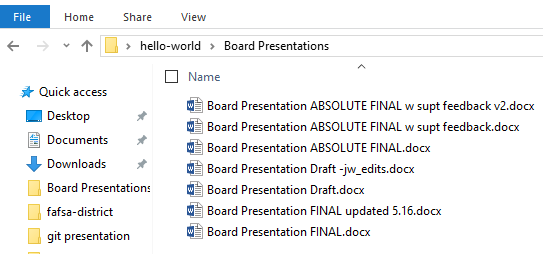

# Using Git to Promote Collaboration and Reproducible Research
## Intro to Git
Git is a version control system that tracks changes in a file directory.  It is an application that can run on your computer and track changes to your files. 

It prevents you from ever dealing with files like: `Board_Presentation_ABSOLUTE FINAL w supt feedback v2.docx` __

### Initializing a Git repository and committing changes
__1. You can open a git command line interface by right clicking in a folder. __

__2. Git begins tracking a folder (repository) when you type the command `git init`. Only folders in which you have initialized git are tracked. __

__3. You can check the status of what is being tracked by the command `git status`. __

__4. In order to create a snapshot of the files in your repository you need to "stage" the changes that you want to commit to the snapshot.  This is done by the command `git add <file name>` or add multiple file changes with `git add .` __

__5. A snapshot of your repository happens when you 'commit' the changes.  This is accomplished by the command `git commit -m 'My message'` where 'My message' is the message you create to indicate what is being committed (snapshot). __

__6. After you have edited a file you can check the status of you repository to see that a file has been changed. And you can use the command `git diff` to see the edits/differences in the from the last commit.
__

__7. If you would like these changes to be part of the next commit you need to 'stage' the changes.  This again is done by the `git add <file name>` or `git add .` command. __

__8. You can now commit the modifications that you have added with `git commit -m 'Another message'` __

### Branching
Git branching is a powerful feature that allows you to continue development or edits without messing with the main files.

__9. You can create a branch and 'checkout' that branch simultaneously with the command `git checkout -b <new branch name>`.  This essentially gives you a copy of the set of files that existed that you can edit or add to without affecting the originals. __

__10. You can check to see what branches exist by the command `git branch` __

 
__11. While on the 'sdp' branch of the 'hello world' repository I have edited the file to say 'Hello, SDP' instead of 'Hello, World'.  I have also changed the name of the file. I can check the status of this branch, `git status`, to see that changes are detected by git.__

__12. I can now add those changes to be staged for commit. __

__13. Now those changed will be commited. Notice the new file name. __

__14. We can go back to the original branch with the command `git checkout master`.  Notice that when we do this we go back to the original files.  These files do not have the edits and work that was done on the 'sdp' branch. __

__15. In order to merge the edits from the sdp branch to the original files on the master branch you use the `git merge <branch name>` command.__

### GitHub
GitHub is like social media for coding.  It is a git repository hosting service.  This is where you can share your git repositories with other people.  You can use git on your local computer without ever using GitHub... but you would be missing out.

The social aspect of GitHub is what makes it so amazingly powerful.  You can share your code, you can collaborate on projects, or you can learn from other people's code.  

__16. In order to share your local git repository on GitHub you must first create an empty repository on GitHub. You an do that by clicking on 'New Repository' __

__17. Next you can name the GitHub repository with the same name as the repository on your local machine.  Then click 'Create repository'. __

__18. Once you click 'Create repository' GitHub gives you explicit instructions on how you can populate that repository with your local repository (directory / folder).__

__19. Next from the command line of the local machine we will push the local folder contents to GitHub.  First we need to add the url of the GitHub repository. __

__20. Now the contents of the local directory can be pushed to GitHub. __

__21. With the files now hosted on GitHub they can also be edited and commited there. Click the file to edit.  And then click the edit button. __

__22. These changes that were created in GitHub can now be committed in GitHub.  Just add your commit message and click 'Commit changes'. __

__23. Finally, we can pull down the edits from GitHub to our local machine.  This is done from the local machine and can be done on the command line with the code `git pull origin master`__
